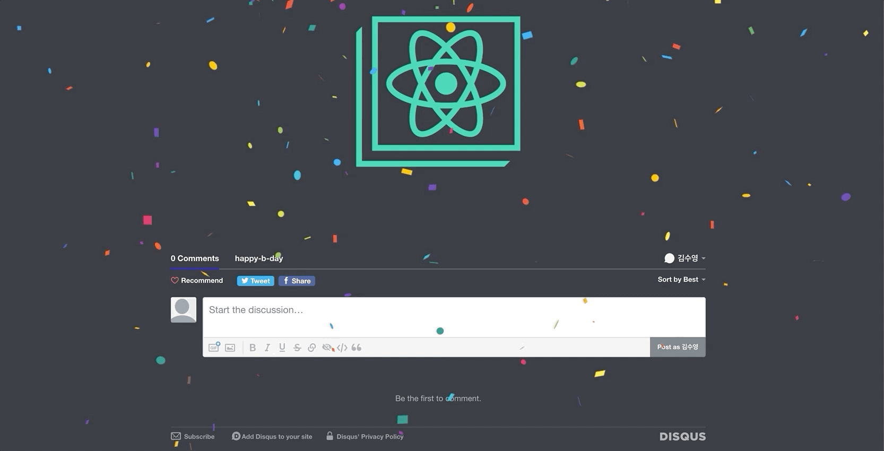

# Birthday Congraz!!

simple react SPA for react beginner

### Prerequisites

- Node.js
- npm

### Installing

- clone this repo
- install packages by `$ npm i (or yarn install)`

## Built With

- [React-Confetti](https://www.npmjs.com/package/react-confetti) - Confetti without the cleanup.
- [Disqus-React](https://www.npmjs.com/package/disqus-react) - Component for integrating the Disqus comments embed and comment count into a React.js SPA
- [ROME](https://rometools.github.io/rome/) - Used to generate RSS Feeds

## Authors

- **Swimming Kim** / github page: [https://github.com/kimsooyoung](https://github.com/kimsooyoung)

## Acknowledgments

- Birthday Congraz is on developing now
- :)
